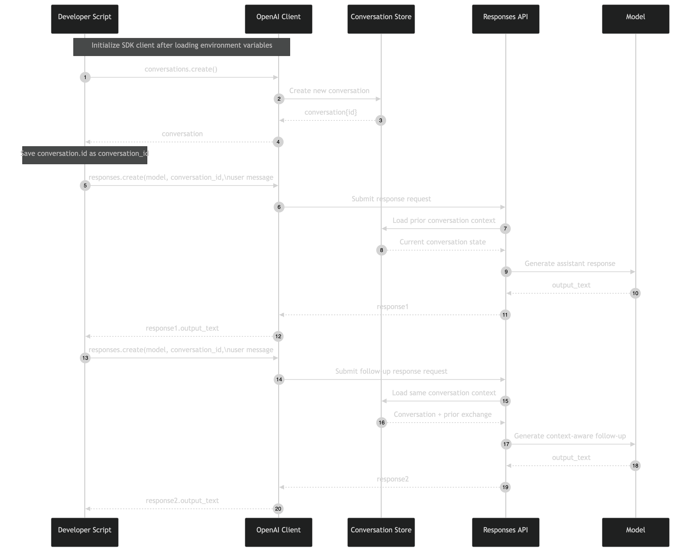

# Basic OpenAI Conversation


A minimal two-turn example of durable model context with the OpenAI Conversations
and Responses APIs. The script creates one remote Conversation, sends two user
messages into it, and prints both assistant responses.

This is a focused demonstration. It intentionally omits user identity, local
persistence, retries, cleanup, and production lifecycle controls so the stateful API
pattern remains visible.

## Architecture Overview

| Component                       | Responsibility                                                              |
| ------------------------------- | --------------------------------------------------------------------------- |
| `conversation_api_basic.py`     | Runs the complete create-and-continue sequence                              |
| `client.conversations.create()` | Creates the durable remote Conversation and returns its `conv_...` ID       |
| `client.responses.create()`     | Generates each assistant response and appends the turn to the Conversation  |
| `conversation_id`               | Connects both response calls to the same remote state                       |
| `response.output_text`          | Returns the aggregate assistant text without assuming output-item positions |

Importing or running this script immediately initializes an OpenAI client. Running
it makes one Conversation request and two model-backed Response requests.

## What It Demonstrates

- Creating an OpenAI Conversation with `client.conversations.create()`.
- Passing the returned ID through the `conversation` response parameter.
- Continuing a conversation without resending earlier messages from the client.
- Reading assistant text through the SDK's `response.output_text` convenience field.
- Keeping OpenAI Conversation state separate from local application state.
- Using `load_dotenv(override=True)` so repository-root `.env` values take precedence.

## Key Design Decisions

- **Use one durable Conversation ID** — both model calls reference the same
  `conversation_id`, allowing the service to supply existing Conversation items.
- **Send only the new user turn** — the second request contains only the joke prompt;
  the script does not construct or resend a transcript.
- **Use `conversation`, not `previous_response_id`** — these are separate state
  mechanisms and are not combined in this example.
- **Read `output_text` rather than indexing `output`** — a Response can contain
  reasoning, tool, or message items in different positions.
- **Leave lifecycle behavior visible** — the remote Conversation is not deleted at
  shutdown, making persistence explicit rather than hidden behind cleanup code.

## State Model

| Property                 | Behavior                                                     |
| ------------------------ | ------------------------------------------------------------ |
| Remote state             | One OpenAI Conversation and its items                        |
| Local state              | The ID held in memory for the lifetime of the Python process |
| Cross-turn continuity    | Yes, because both Responses use the same Conversation ID     |
| Cross-process continuity | Not provided because the ID is not written locally           |
| User isolation           | None                                                         |
| Automatic cleanup        | None                                                         |
| Model context limit      | Still bounded by the selected model's context window         |

The Conversation ID identifies remote state; it is not proof that a caller is
authorized to access that state.

## Simplified Request Flow

```text
1. Script creates an OpenAI client from OPENAI_API_KEY
2. conversations.create() returns conversation.id
3. First responses.create(conversation=id, input=first prompt)
   └── user input and assistant output become Conversation items
4. Second responses.create(conversation=id, input=second prompt)
   └── stored Conversation items provide prior context
5. Script prints response1.output_text and response2.output_text
```



The essential pattern is:

```python
conversation = client.conversations.create()

response = client.responses.create(
    model="gpt-5.6-luna",
    conversation=conversation.id,
    input=[{"role": "user", "content": "Hello! What can you do?"}],
)

print(response.output_text)
```

## Files

```text
conversation_basic_example/
├── conversation_api_basic.py
├── mermaid-diagram.png
└── README.md
```

## Runtime Defaults

| Setting               | Value                           |
| --------------------- | ------------------------------- |
| Model                 | `gpt-5.6-luna`                  |
| First prompt          | `Hello! What can you do?`       |
| Second prompt         | `Can you tell me a short joke?` |
| Response mode         | Synchronous, non-streaming      |
| Local persistence     | None                            |
| Conversation deletion | Not performed                   |

## Run It

Prerequisites:

- Python 3.13 or later.
- [`uv`](https://docs.astral.sh/uv/) for dependency management.
- An OpenAI API key with access to the configured model.

From the repository root:

```bash
uv sync --locked
source .venv/bin/activate
```

Create `.env` in the repository root:

```dotenv
OPENAI_API_KEY=your_api_key_here
```

Run the example:

```bash
uv run python Conversation_API/conversation_basic_example/conversation_api_basic.py
```

The calls require network access and consume OpenAI API quota.

## Expected Behavior

The terminal prints a new Conversation ID followed by two assistant responses:

```text
Conversation ID: conv_...
Assistant 1: ...
Assistant 2: ...
```

Model wording is nondeterministic. The first prompt explicitly asks what the
assistant can do, so a capabilities list or introductory preamble is expected. It is
not duplicated history. To make the first response shorter, change the prompt or add
an instruction such as `Reply in one sentence`.

Each run creates another remote Conversation. Because the script does not persist
the returned ID locally, a later run does not resume the Conversation created by an
earlier process.

## Retention, Trust, and Limitations

1. Conversation items are stored remotely and are not written to this directory.
2. The script does not associate the Conversation with an authenticated application
   user or tenant.
3. No deletion request is made, so the example does not implement a complete remote
   data lifecycle.
4. No exception handling, timeout policy, retry policy, or request-ID logging is
   provided.
5. There is no token-budget, compaction, or long-context policy.
6. Anyone adapting the pattern must authorize access before accepting a
   caller-supplied Conversation ID.
7. API availability, model access, generated wording, latency, and usage cost vary by
   project and request.

For cross-process ID persistence, see the
[persistent-memory example](../conversation_persistent_memory_app/README.md). For
local ownership and TTL metadata, see the
[multi-user example](../conversation_multi_user_temp_memory_app/README.md).

## Troubleshooting

| Symptom                               | What to Check                                                 |
| ------------------------------------- | ------------------------------------------------------------- |
| `AuthenticationError`                 | Confirm `OPENAI_API_KEY` exists in the repository-root `.env` |
| `model_not_found` or permission error | Confirm the API project can use `gpt-5.6-luna`                |
| Long first answer                     | The prompt asks for a description of assistant capabilities   |
| Different wording on repeated runs    | Model text is nondeterministic                                |
| Conversation cannot be resumed later  | This script does not save `conversation_id` locally           |

## Test It

Fast repository checks parse every example without making OpenAI requests:

```bash
uv run pytest -m "not live"
```

The repository's opt-in live test makes a billable Response request but does not run
this complete two-turn script.
