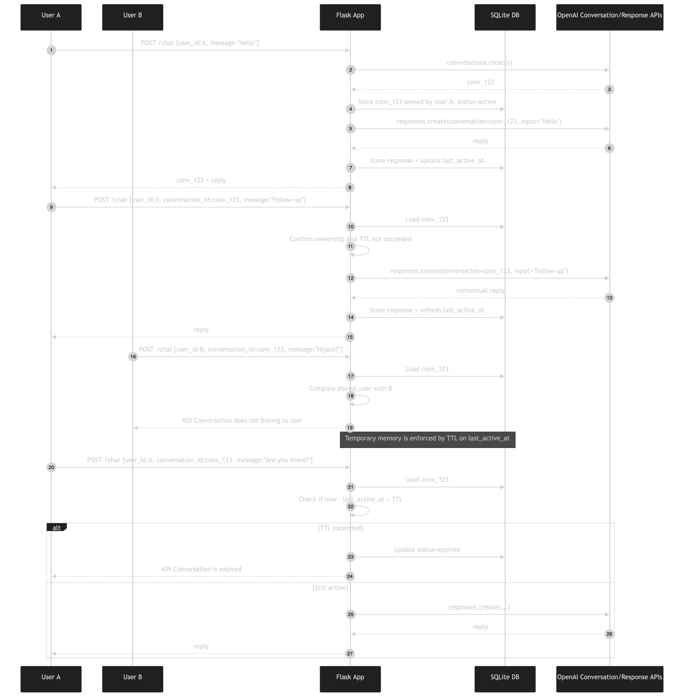

# Multi-User Conversation Service with Local TTL State


A Flask API that combines durable OpenAI Conversations with a local SQLite control
plane. OpenAI stores model-facing Conversation items; SQLite stores caller-supplied
ownership, local status, activity timestamps, prompt and response text, token usage,
and the serialized SDK Response.

The service demonstrates how remote Conversation state and local application state
can work together. It is not a secure multi-tenant system: `user_id` comes directly
from request JSON, several routes omit ownership checks, and lifecycle changes do
not delete remote OpenAI resources.

## Architecture Overview

| Component                | Responsibility                                                          |
| ------------------------ | ----------------------------------------------------------------------- |
| Flask `app`              | Exposes chat, list, close, and locally logged response endpoints        |
| OpenAI Conversations API | Creates durable Conversation IDs and stores their items                 |
| OpenAI Responses API     | Produces each assistant reply with Conversation context                 |
| `conversations` table    | Tracks local owner, status, creation time, and activity time            |
| `responses` table        | Stores each accepted prompt, reply, usage object, and raw Response JSON |
| Lazy TTL helpers         | Mark an active local row expired when a later chat request evaluates it |

Importing `app.py` loads `.env`, initializes the OpenAI client, and constructs the
Flask application. Tables are created only when the script runs its main block.

## State Responsibilities

| Concern                  | OpenAI Conversation                                     | Local SQLite Control Plane                          |
| ------------------------ | ------------------------------------------------------- | --------------------------------------------------- |
| Model conversation items | Stored remotely                                         | Not used as model context                           |
| Conversation continuity  | Reusing `conversation_id`                               | Persists the ID between requests and restarts       |
| User association         | Not established by this example                         | `user_id` column and equality check in `POST /chat` |
| Lifecycle status         | Not changed by local status                             | `active`, `expired`, or `closed`                    |
| Activity tracking        | Not represented by the local TTL                        | `created_at` and `last_active_at`                   |
| Response audit fields    | Response exists remotely according to API data controls | Prompt, output, usage, and full serialized Response |
| Deletion                 | Not implemented                                         | Not implemented                                     |

Local expiry prevents this application from continuing a Conversation. It does not
expire or delete the corresponding OpenAI Conversation.

## What It Demonstrates

- Creating an OpenAI Conversation when a chat request omits `conversation_id`.
- Reusing a Conversation ID to supply prior remote items to later Responses.
- Associating a caller-provided `user_id` with a local Conversation row.
- Rejecting a continuation when the supplied user differs from the stored user.
- Applying a configurable inactivity TTL through lazy evaluation.
- Logging response identifiers, model name, prompt, output, usage, and raw JSON.
- Listing local Conversations and response logs through HTTP endpoints.
- Closing a Conversation locally without altering remote Conversation state.

## Key Design Decisions

- **Separate model state from control state** — remote Conversation items provide
  model continuity; SQLite provides application-specific ownership and lifecycle
  fields.
- **Require the returned ID for continuation** — clients create by omitting
  `conversation_id` and continue by sending the returned value.
- **Evaluate expiry lazily** — no scheduler scans rows. A chat continuation checks
  elapsed inactivity and changes the row to `expired` when needed.
- **Store complete Response JSON for inspection** — the example favors visibility
  over data minimization; production systems should normally retain less.
- **Keep status local** — `close` and TTL behavior demonstrate application policy
  without implying remote deletion.

## Identity and Isolation

| Scenario                           | Behavior                                                              |
| ---------------------------------- | --------------------------------------------------------------------- |
| No Conversation ID                 | Creates a remote Conversation owned locally by the supplied `user_id` |
| Same ID and same `user_id`         | Continues if local status is `active`                                 |
| Same ID and different `user_id`    | `POST /chat` returns HTTP 403                                         |
| Unknown ID                         | `POST /chat` returns HTTP 400                                         |
| Expired or closed row              | `POST /chat` returns HTTP 409                                         |
| List, close, or response-log route | No reliable tenant authorization is enforced                          |

The comparison in `POST /chat` is useful partitioning logic, but it is not
authentication. An attacker can choose any `user_id` unless a trusted identity layer
is added before Flask handles the request.

## Local Database Schema

### `conversations`

| Column            | Purpose                                                   |
| ----------------- | --------------------------------------------------------- |
| `conversation_id` | OpenAI Conversation ID and primary key                    |
| `user_id`         | Caller-supplied local owner label                         |
| `status`          | `active`, `expired`, or `closed`                          |
| `created_at`      | ISO-formatted UTC creation timestamp                      |
| `last_active_at`  | ISO-formatted UTC timestamp of the last accepted response |

### `responses`

| Column            | Purpose                                    |
| ----------------- | ------------------------------------------ |
| `response_id`     | OpenAI Response ID and primary key         |
| `conversation_id` | Local association with a Conversation row  |
| `user_id`         | Duplicated owner label for inspection      |
| `created_at`      | Local ISO-formatted UTC timestamp          |
| `model`           | Model identifier returned by the Response  |
| `input_text`      | User message sent to OpenAI                |
| `output_text`     | Aggregate assistant text                   |
| `usage_json`      | Serialized SDK usage object when available |
| `raw_json`        | Complete serialized SDK Response           |

The schema declares a foreign key from `responses` to `conversations`, but the app
does not enable SQLite foreign-key enforcement on each connection.

## Runtime Defaults

| Setting             | Value                                                                       |
| ------------------- | --------------------------------------------------------------------------- |
| Model               | `gpt-5.6-luna`                                                              |
| Bind address        | `127.0.0.1`                                                                 |
| Port                | `5000`                                                                      |
| Flask debug mode    | Enabled                                                                     |
| Local database      | `Conversation_API/conversation_multi_user_temp_memory_app/conversations.db` |
| Inactivity TTL      | `30` minutes                                                                |
| TTL variable        | `CONVERSATION_TTL_MINUTES`                                                  |
| Time representation | UTC ISO strings                                                             |

## Simplified Request Flow

```text
1. POST /chat receives user_id, message, and optional conversation_id
2. No ID supplied
   ├─ conversations.create()
   └─ insert local active Conversation row
3. Load local row and compare stored user_id
4. Evaluate inactivity TTL
   ├─ expired or closed: return HTTP 409
   └─ active: responses.create(conversation=conversation_id)
5. Insert local Response audit row
6. Update last_active_at
7. Return conversation_id, response_id, and reply
```



## Files

```text
conversation_multi_user_temp_memory_app/
├── app.py
├── conversations.db
├── mermaid-diagram.png
└── README.md
```

The database path is relative to the repository root. Run the server from that root
unless the source path is deliberately adjusted.

## Run It

Prerequisites:

- Python 3.13 or later.
- [`uv`](https://docs.astral.sh/uv/).
- An OpenAI API key with access to `gpt-5.6-luna`.
- `curl` or another HTTP client for endpoint exercises.

From the repository root:

```bash
uv sync --locked
source .venv/bin/activate
```

Create `.env`:

```dotenv
OPENAI_API_KEY=your_api_key_here
CONVERSATION_TTL_MINUTES=30
```

Start the server:

```bash
uv run python Conversation_API/conversation_multi_user_temp_memory_app/app.py
```

It listens on `http://127.0.0.1:5000`. Stop other repository examples using port
5000 before starting it.

## HTTP API

### `POST /chat`

Create a Conversation by omitting `conversation_id`:

```bash
curl -X POST http://127.0.0.1:5000/chat \
  -H "Content-Type: application/json" \
  -d '{"user_id":"alice","message":"Remember that I prefer Python."}'
```

Example response shape:

```json
{
  "conversation_id": "conv_...",
  "response_id": "resp_...",
  "reply": "..."
}
```

Continue it with the returned ID:

```bash
curl -X POST http://127.0.0.1:5000/chat \
  -H "Content-Type: application/json" \
  -d '{"user_id":"alice","conversation_id":"conv_...","message":"What language do I prefer?"}'
```

| Request Field     | Required | Meaning                                      |
| ----------------- | -------- | -------------------------------------------- |
| `user_id`         | Yes      | Local owner label used by the equality check |
| `message`         | Yes      | User input sent to the model                 |
| `conversation_id` | No       | Omit to create; include to continue          |

| Status | Condition                                 |
| ------ | ----------------------------------------- |
| `200`  | Response created and local rows committed |
| `400`  | Missing field or unknown Conversation ID  |
| `403`  | Stored and supplied user IDs differ       |
| `409`  | Local Conversation is expired or closed   |

### `GET /conversations`

List local rows, optionally filtered by `user_id` or `status`:

```bash
curl "http://127.0.0.1:5000/conversations?user_id=alice&status=active"
```

This route does not run the TTL check, authenticate the caller, or fetch remote
Conversation items.

### `POST /conversations/<conversation_id>/close`

```bash
curl -X POST http://127.0.0.1:5000/conversations/conv_.../close
```

The route writes `closed` locally. It does not verify ownership, report whether a
row existed, or delete the OpenAI Conversation.

### `GET /responses/<conversation_id>`

```bash
curl http://127.0.0.1:5000/responses/conv_...
```

The route returns locally logged fields in ascending creation order. It does not
call the Conversation Items endpoint, and it performs no ownership check.

## Expected Behavior

A successful two-turn sequence keeps the same `conversation_id` and produces a new
`response_id` for each turn. The second model response can use earlier remote
Conversation items even though the request body sends only the new message.

The local `responses` table grows by one row after each successful Response. The
local `conversations` row remains one row and receives a later `last_active_at`.

Model wording varies. The statement remembered by the model is remote Conversation
context; the locally stored `input_text` and `output_text` columns are audit copies
and are not resubmitted by the application.

## Lifecycle Behavior

| Local Status | Entered When                                            | Can `/chat` Continue?                | Remote Conversation Deleted? |
| ------------ | ------------------------------------------------------- | ------------------------------------ | ---------------------------- |
| `active`     | Conversation is created                                 | Yes, until lazy TTL evaluation fails | No                           |
| `expired`    | A later chat request observes inactivity beyond the TTL | No                                   | No                           |
| `closed`     | Close endpoint updates the row                          | No                                   | No                           |

An untouched row can remain marked `active` beyond the configured duration because
there is no scheduler. Expiry becomes visible only when `POST /chat` calls
`expire_if_needed()` for that ID.

## Retention, Trust, and Limitations

1. `user_id` is untrusted request data, not authenticated identity.
2. Conversation listing, closing, and response-log retrieval lack tenant
   authorization.
3. Prompts, replies, usage, and complete Response JSON are stored in plaintext
   without redaction or a deletion schedule.
4. Local close or expiry does not delete remote Conversation or Response data.
5. SQLite and the Flask development server are not suitable for high-concurrency or
   multi-worker production deployment.
6. OpenAI calls and SQLite writes do not share a transaction. Partial failures can
   leave remote and local state inconsistent.
7. Several early route returns leave the initially opened SQLite connection without
   an explicit close.
8. Foreign-key enforcement, database change management, rate limits, idempotency,
   request-size limits, retries, and abuse controls are absent.
9. Flask debug mode is enabled and must not be exposed to untrusted networks.

Production use requires authenticated identity, authorization on every route,
transactional boundaries, data minimization, retention and deletion workflows,
secure logging, monitoring, and a production WSGI deployment.

## Troubleshooting

| Symptom                     | What to Check                                       |
| --------------------------- | --------------------------------------------------- |
| `Invalid conversation_id`   | Confirm the ID exists in this local database        |
| HTTP 403                    | The request's `user_id` differs from the stored row |
| HTTP 409                    | The local row is expired or closed                  |
| OpenAI resource unavailable | Confirm the ID belongs to the API key's project     |
| SQLite path error           | Start the app from the repository root              |
| Port already in use         | Stop another Flask example bound to port 5000       |

## Test It

Fast repository checks parse the application without starting Flask or contacting
OpenAI:

```bash
uv run pytest -m "not live"
```

The repository does not provide dedicated route tests for this example. Running the
`curl` commands invokes real, billable model requests.
