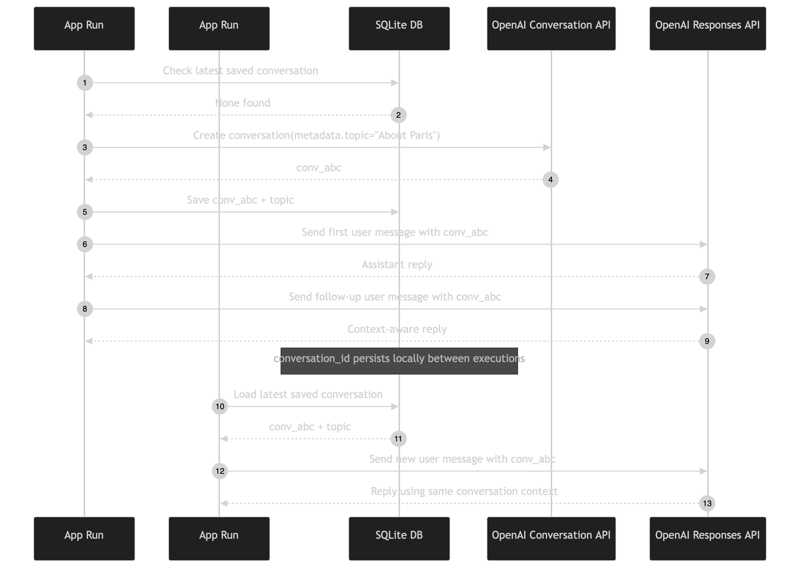

# Persistent OpenAI Conversation CLI


An interactive command-line example that resumes the same OpenAI Conversation
across Python process restarts. OpenAI stores the Conversation items; a local SQLite
database stores only the remote Conversation ID and a human-readable topic.

The included database is intentionally empty. Each user therefore creates a
Conversation inside the OpenAI project associated with their own API key instead of
receiving a pointer to another project's remote resource.

This is a persistence demonstration, not a production memory system. The topic,
single-row selection behavior, retention choices, and manual reset procedure are
deliberately simple and require additional controls in a real application.

## Architecture Overview

| Component                          | Responsibility                                                       |
| ---------------------------------- | -------------------------------------------------------------------- |
| `app.py`                           | Creates or resumes a Conversation and runs the interactive chat loop |
| OpenAI Conversations API           | Stores user, assistant, and other Conversation items remotely        |
| OpenAI Responses API               | Generates each reply with the stored Conversation as context         |
| `conversations.db`                 | Stores only `conversation_id` and `topic` pointers locally           |
| `list_conversations_db.py`         | Displays local SQLite rows without making an OpenAI request          |
| `retrieve_conversation_history.py` | Fetches and prints the remote Conversation items                     |

Importing `app.py` initializes its OpenAI client. Running `app.py` can create a
remote Conversation, append items, and modify the SQLite database.

## Two Persistence Layers

| Property                   | OpenAI Conversation                                 | Local SQLite Row                            |
| -------------------------- | --------------------------------------------------- | ------------------------------------------- |
| Purpose                    | Preserve model-facing Conversation items            | Preserve the ID needed to find remote state |
| Content                    | Messages, tool calls, tool outputs, and other items | Numeric row ID, Conversation ID, and topic  |
| Message transcript         | Yes                                                 | No                                          |
| Topic                      | Remote metadata                                     | Local display value                         |
| Used to resume chat        | Yes, through `conversation=conversation_id`         | Supplies the ID to `app.py`                 |
| Deleted by clearing SQLite | No                                                  | Yes                                         |

The local topic is metadata. Setting it to `My Topic` does not tell the model what to
discuss and does not recreate missing Conversation history.

## What It Demonstrates

- Creating a durable Conversation when no local pointer exists.
- Persisting the returned `conv_...` identifier in SQLite.
- Loading the newest stored pointer on a later process run.
- Appending new user and assistant turns through `responses.create(...)`.
- Inspecting local pointer data separately from remote Conversation history.
- Iterating every Conversation item in chronological order with automatic paging.
- Distinguishing local deletion from remote Conversation deletion.

## Key Design Decisions

- **Keep the database intentionally small** — local storage contains a pointer and
  label, not a duplicate transcript.
- **Select the newest row** — `ORDER BY id DESC LIMIT 1` gives the CLI one active
  Conversation without adding a selection interface.
- **Use a neutral default topic** — `My Topic` is easy to replace before creating a
  Conversation and does not imply a specific domain.
- **Use the Conversation Items API for history** — remote items are retrieved from
  their authoritative store rather than inferred from SQLite.
- **Render heterogeneous items safely** — the history utility prints messages as
  readable text and retains tool or other item types as structured JSON.
- **Make reset behavior explicit** — starting a new Conversation requires clearing
  local rows; this does not silently delete remote data.

## Database Schema

The existing database file contains this empty table:

```sql
CREATE TABLE conversations (
    id INTEGER PRIMARY KEY AUTOINCREMENT,
    conversation_id TEXT NOT NULL,
    topic TEXT
);
```

`app.py` also calls `CREATE TABLE IF NOT EXISTS` at startup. The database does not
enforce uniqueness on `conversation_id`, and it does not contain a user or tenant
ownership field.

## Runtime Defaults

| Setting           | Value                                                                  |
| ----------------- | ---------------------------------------------------------------------- |
| Model             | `gpt-5.6-luna`                                                         |
| Default topic     | `My Topic`                                                             |
| App database path | `Conversation_API/conversation_persistent_memory_app/conversations.db` |
| Selected row      | Highest local `id`                                                     |
| History order     | Ascending                                                              |
| History page size | 100 items                                                              |
| Exit commands     | `exit` or `quit`                                                       |

Change the topic before the first run if another label is required:

```python
topic = "My Topic"  # Default value; change it to set your own topic.
```

## Simplified Request Flow

```text
1. app.py initializes the local table
2. Read newest SQLite row
   ├─ row exists: reuse conversation_id
   └─ no row: conversations.create(metadata={"topic": "My Topic"})
                └─ store conversation_id + topic in SQLite
3. User enters one message
4. responses.create(conversation=conversation_id, input=new message)
   ├─ OpenAI supplies existing Conversation items as context
   └─ new user and assistant items are appended remotely
5. CLI prints response.output_text
6. A later process run loads the same local pointer
```



## Identity and Access

| Scenario                                     | Result                                                                           |
| -------------------------------------------- | -------------------------------------------------------------------------------- |
| Same API project, stored ID exists           | The Conversation can be resumed                                                  |
| Different API project                        | The stored ID is unavailable to that request                                     |
| ID deleted remotely                          | The local pointer is stale and requests fail                                     |
| Local database copied without project access | The ID and topic are visible, but remote history remains inaccessible            |
| Local row deleted                            | The next app run creates another Conversation; the earlier remote object remains |

A Conversation ID is a resource identifier, not a secret credential and not an
authorization mechanism.

## Files

```text
conversation_persistent_memory_app/
├── app.py
├── conversations.db
├── list_conversations_db.py
├── retrieve_conversation_history.py
├── mermaid-diagram.png
└── README.md
```

`app.py` uses a repository-root-relative database path. Run it from the repository
root so it opens the included file. The two inspection utilities resolve the
database from their own script directory.

## Run It

Prerequisites:

- Python 3.13 or later.
- [`uv`](https://docs.astral.sh/uv/).
- An OpenAI API key with access to `gpt-5.6-luna`.
- The `sqlite3` command-line utility only if using the manual reset command below.

From the repository root:

```bash
uv sync --locked
source .venv/bin/activate
```

Create `.env` in the repository root:

```dotenv
OPENAI_API_KEY=your_api_key_here
```

Start or resume the chat:

```bash
uv run python Conversation_API/conversation_persistent_memory_app/app.py
```

Type `exit` or `quit` to stop. Restarting the command loads the newest local
Conversation pointer and continues that remote Conversation.

## Expected Behavior

Before `app.py` has created a Conversation, local inspection reports:

```text
No conversations found in the database.
```

On the first app run, the script creates a Conversation and prints its ID and topic.
On subsequent runs, it prints messages similar to:

```text
Loaded existing conversation: conv_...
Stored topic: My Topic

You: What did we discuss earlier?
Assistant: ...
```

Model wording varies. Continuity comes from reusing the ID, not from the topic text.

## Inspect the Local Database

Run the local-only inspector:

```bash
uv run python Conversation_API/conversation_persistent_memory_app/list_conversations_db.py
```

The output below is for demonstration purposes only. It shows what users can expect
after creating their own Conversation. The displayed ID is an example identifier,
not a shared Conversation included in the database:

```text
Found 1 conversation(s) in the database:
--------------------------------------------------
id                   | conversation_id      | topic
--------------------------------------------------
1                    | conv_69a2a9c746dc819592bed824482b9c6a0e2f646d297794da | My Topic
```

This output confirms only that SQLite has a pointer. It does not display user or
assistant messages.

## Retrieve Remote Conversation History

After `app.py` has stored a Conversation ID, run:

```bash
uv run python Conversation_API/conversation_persistent_memory_app/retrieve_conversation_history.py
```

The utility reads the newest local ID, requests all remote items in ascending order,
and prints output similar to:

```text
Conversation ID: conv_...
Stored topic: My Topic
Items retrieved: 2

Conversation history:

User: What did we discuss earlier?

Assistant: We discussed your earlier question.
```

To inspect an explicit ID instead of the newest local row:

```bash
uv run python Conversation_API/conversation_persistent_memory_app/retrieve_conversation_history.py \
  --conversation-id conv_your_conversation_id
```

When `--conversation-id` is used, the utility does not read a local topic, so the
`Stored topic` line is omitted.

## Start a New Conversation

The chat CLI has no interactive `new conversation` command. It always resumes the
newest row while any row exists.

To preserve a recoverable local copy before resetting:

```bash
cp Conversation_API/conversation_persistent_memory_app/conversations.db \
  Conversation_API/conversation_persistent_memory_app/conversations.db.backup
```

Exit the app, clear all local pointers, and run it again:

```bash
sqlite3 Conversation_API/conversation_persistent_memory_app/conversations.db \
  "DELETE FROM conversations;"

uv run python Conversation_API/conversation_persistent_memory_app/app.py
```

The empty table causes `get_or_create_conversation()` to call
`client.conversations.create(...)` and persist a new ID. Clearing SQLite does not
delete the earlier remote Conversation.

## Retention, Trust, and Limitations

1. The app has one globally selected Conversation and no authenticated user or
   tenant boundary.
2. The topic is duplicated locally and remotely without reconciliation.
3. SQLite errors and OpenAI errors are not handled in the interactive app.
4. There is no concurrency control, uniqueness rule, or database change-management
   mechanism.
5. The app does not compact long histories or enforce a token budget. Persisted
   items can outlive the amount of context usable in one model request.
6. Local reset and remote deletion are independent operations; the example does not
   provide a complete deletion workflow.
7. The remote history utility exposes all items accessible through the supplied ID.
   Add authorization before exposing equivalent behavior in a service.
8. API calls require network access, consume quota, and can fail because of project,
   model, or resource permissions.

## Troubleshooting

| Symptom                             | What to Check                                                        |
| ----------------------------------- | -------------------------------------------------------------------- |
| No local Conversations              | Run `app.py` once or pass `--conversation-id` to the history utility |
| Conversation unavailable            | Confirm the ID belongs to the API key's project and still exists     |
| A new topic is ignored by the model | Topic metadata is a label, not a model instruction                   |
| App always resumes the same ID      | Clear all local rows before starting another Conversation            |
| History omits the local topic       | Explicit `--conversation-id` mode does not load SQLite metadata      |
| Database path error                 | Run `app.py` from the repository root                                |

## Test It

Fast tests cover SQLite selection, Conversation Items request parameters, readable
message rendering, and repository syntax without contacting OpenAI:

```bash
uv run pytest -m "not live"
```

Running `app.py` or retrieving accessible remote history makes real OpenAI API
requests. The included database remains empty until a user runs the app.
