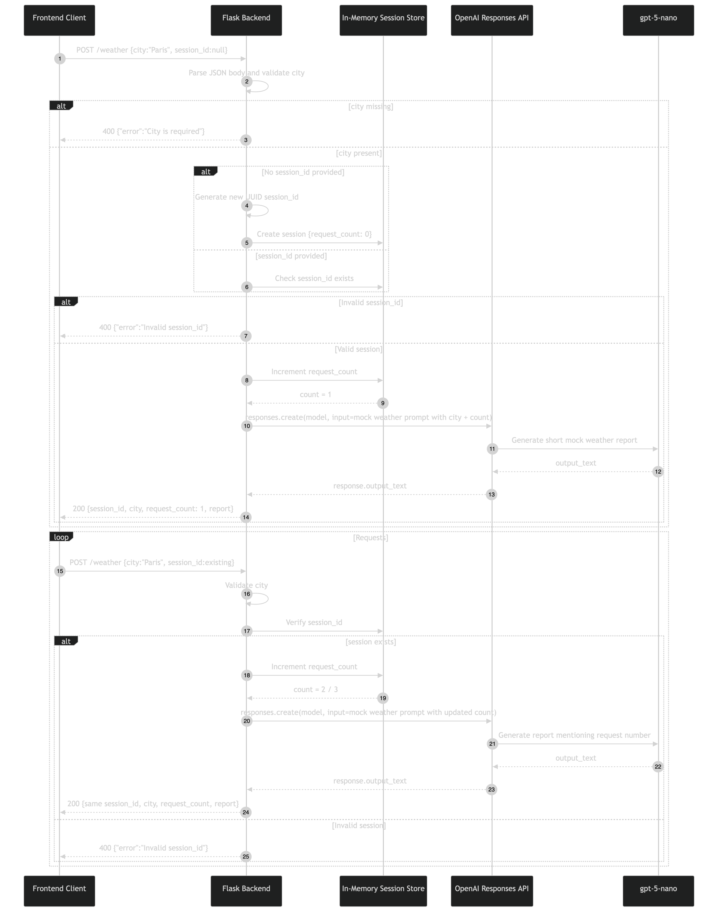

# Mock Weather Service with In-Memory Sessions


A Flask service that adds a generated session ID and request counter to the mock
weather endpoint. The session changes application behavior by placing the incremented
counter in each prompt, but it does not provide model conversation memory.

Every weather request creates an independent OpenAI Response. Earlier messages and
reports are not supplied to later requests. The weather remains deliberately
fabricated and must not be treated as observed or forecast data.

This is a session-mechanics demonstration, not a production identity, persistence,
or weather service.

## Architecture Overview

| Component             | Responsibility                                                     |
| --------------------- | ------------------------------------------------------------------ |
| `backend.py`          | Creates, validates, and increments process-local sessions          |
| `sessions` dictionary | Maps each UUID to a `request_count`                                |
| Flask                 | Exposes `POST /weather` on the local development server            |
| OpenAI Responses API  | Generates one independent mock report per request                  |
| `frontend.py`         | Creates one session, reuses it twice, and prints all three reports |

Importing the backend initializes the OpenAI client and the empty session dictionary.
Running the frontend immediately makes three HTTP requests.

## What It Demonstrates

- Generating an application session ID with `uuid_utils.uuid4()`.
- Returning the session ID to a client and accepting it on later requests.
- Maintaining a process-local request counter.
- Injecting application state into a model prompt.
- Rejecting an unknown non-empty session ID.
- Distinguishing application session state from OpenAI Conversation state.

## Key Design Decisions

- **Keep state in one dictionary** — the lifecycle is easy to inspect, and restart
  behavior is obvious.
- **Create when the ID is omitted** — the first request needs only a city; later
  requests carry the server-generated ID.
- **Increment before the model request** — the prompt can mention the request number,
  though a failed model call still leaves the counter incremented.
- **Do not send earlier model output** — the example isolates local counters from
  model-facing conversation context.
- **Return state with every response** — the client receives both `session_id` and
  `request_count` and does not need cookies.

## Session State Model

```python
sessions = {
    "<uuid>": {"request_count": 3}
}
```

| Property               | Behavior                                                  |
| ---------------------- | --------------------------------------------------------- |
| Session identifier     | UUID string generated when `session_id` is absent or null |
| Stored fields          | `request_count` only                                      |
| Persistence            | Python process memory                                     |
| Restart behavior       | All sessions are lost                                     |
| Expiry                 | None                                                      |
| Maximum size           | None                                                      |
| User ownership         | None                                                      |
| OpenAI Conversation    | Not used                                                  |
| Earlier model messages | Not stored or resent                                      |

The session ID is a lookup key, not authentication. Anyone who knows an active ID
can use its counter because the service has no user or tenant boundary.

## Simplified Request Flow

```text
1. POST /weather receives city and optional session_id
2. Missing city
   └─ return HTTP 400
3. No session_id
   └─ create UUID and {request_count: 0}
4. Unknown non-empty session_id
   └─ return HTTP 400
5. Increment request_count
6. responses.create(input=current city + request number)
7. Return session_id, city, request_count, and report
```



No `conversation` or `previous_response_id` parameter is supplied. The counter is
the only continuity between requests.

## Files

```text
weather_app_with_sessions/
├── backend.py
├── frontend.py
├── mermaid-diagram.png
└── Readme.md
```

## Runtime Defaults

| Setting                | Value                          |
| ---------------------- | ------------------------------ |
| Model                  | `gpt-5.6-luna`                 |
| Endpoint               | `POST /weather`                |
| Bind address           | `127.0.0.1`                    |
| Port                   | `5000`                         |
| Debug mode             | Enabled                        |
| Frontend city          | `Paris` for all three calls    |
| Frontend request count | Three calls                    |
| Session store          | Module-level Python dictionary |

## Run It

Prerequisites:

- Python 3.13 or later.
- [`uv`](https://docs.astral.sh/uv/).
- An OpenAI API key with access to `gpt-5.6-luna`.
- Two terminals, or another HTTP client.

From the repository root:

```bash
uv sync --locked
source .venv/bin/activate
```

Create `.env` in the repository root:

```dotenv
OPENAI_API_KEY=your_api_key_here
```

Start the backend in terminal 1:

```bash
uv run python Responses_API/weather_app_with_sessions/backend.py
```

Run the three-request client in terminal 2:

```bash
uv run python Responses_API/weather_app_with_sessions/frontend.py
```

Only one repository example can bind to port 5000 at a time.

## HTTP Contract

### First Request

Omit the session ID or send JSON `null`:

```json
{
  "city": "Paris",
  "session_id": null
}
```

### Continuation Request

Send the ID returned by the first request:

```json
{
  "city": "Paris",
  "session_id": "session-uuid"
}
```

### Successful Response

```json
{
  "session_id": "session-uuid",
  "city": "Paris",
  "request_count": 2,
  "report": "A short, model-generated mock report mentioning request 2."
}
```

### Error Responses

| Status | Condition                             | Body                             |
| ------ | ------------------------------------- | -------------------------------- |
| `400`  | `city` missing or empty               | `{"error":"City is required"}`   |
| `400`  | Non-empty ID is not in process memory | `{"error":"Invalid session_id"}` |

The endpoint accepts no `user_id`, exposes no read or delete routes, and has no
server-side session cookie.

## Expected Behavior

The frontend captures the first returned ID and reuses it twice. Output follows this
shape:

```text
Request #1
Session ID: <same UUID for all calls>
Request Count: 1
Report: ...

Request #2
Session ID: <same UUID for all calls>
Request Count: 2
Report: ...

Request #3
Session ID: <same UUID for all calls>
Request Count: 3
Report: ...
```

The request count is deterministic for a successful clean run. Report wording and
conditions are not deterministic. Reports can contradict one another because every
model request is independent.

Restarting `backend.py` empties `sessions`. Reusing an ID from the earlier process
then returns `Invalid session_id`.

## Application Session vs OpenAI Conversation

| Question                           | In-Memory Session | OpenAI Conversation                        |
| ---------------------------------- | ----------------- | ------------------------------------------ |
| Remembers request count            | Yes               | Not used for this purpose here             |
| Supplies earlier messages to model | No                | Yes when Responses use the Conversation ID |
| Survives process restart           | No                | Remote object can, if its ID is retained   |
| Tracks authenticated user          | No                | Requires application authorization as well |

Use an application session for counters, preferences, authorization context, and
lifecycle state. Use an OpenAI Conversation when model requests need prior
Conversation items. A larger system may use both with clearly separated roles.

## Retention, Trust, and Limitations

1. Sessions disappear on restart and cannot be shared across worker processes.
2. There is no TTL, cleanup endpoint, session-count bound, or memory-pressure policy.
3. Session IDs are bearer-like lookup values with no authenticated owner.
4. Dictionary updates have no explicit synchronization for concurrent requests.
5. The counter increments before the OpenAI call; a failed call still consumes the
   next number.
6. The frontend has no timeout, status check, or safe handling for error JSON before
   indexing expected success fields.
7. The backend has no OpenAI exception mapping, explicit timeout, retry policy,
   request-ID logging, rate limiting, or input-length control.
8. Generated weather is fictional.
9. Flask debug mode and the development server are not production deployment
   choices.

## Troubleshooting

| Symptom                            | What to Check                                                |
| ---------------------------------- | ------------------------------------------------------------ |
| Connection refused                 | Start the backend and confirm port 5000 is available         |
| `Invalid session_id` after restart | In-memory sessions do not survive process exit               |
| Frontend raises `KeyError`         | Inspect the HTTP status and returned error JSON              |
| Request count skips a number       | A model call may have failed after the counter increment     |
| Reports conflict                   | The model receives no prior report and fabricates conditions |
| Authentication or model error      | Check the root `.env` and project model access               |

## Test It

Fast repository checks parse both scripts without starting Flask or contacting
OpenAI:

```bash
uv run pytest -m "not live"
```

There are no dedicated route or concurrency tests for this session dictionary.
Running the frontend performs three real, billable model requests.

## Related Examples

- [Stateless weather](../stateless_weather_app/Readme.md) removes the session counter.
- [Persisted weather sessions](../weather_app_advanced_sessions/Readme.md) store user
  labels, lifecycle state, and the most recent result in SQLite.
- [OpenAI Conversations](../../Conversation_API/conversation_basic_example/README.md)
  provide model-facing multi-turn context.
